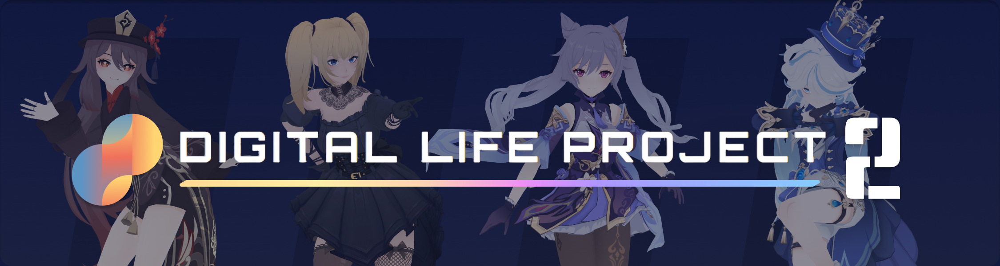
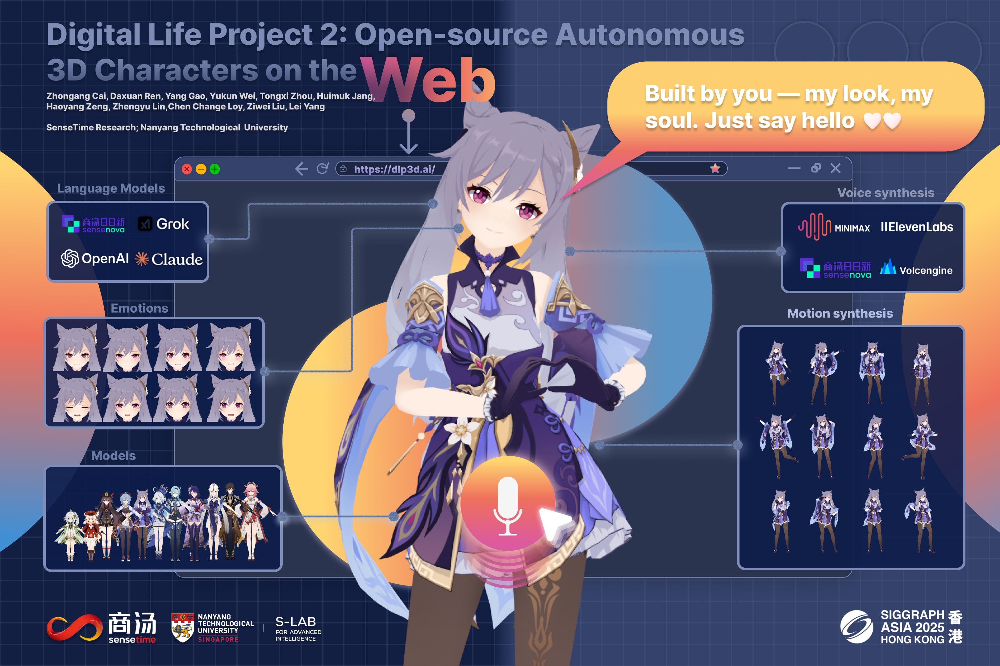

<div align="center">
    
</div>

<br/>

<div align="center">

**SIGGRAPH Asia 2025 (Real-Time Live!), Hong Kong**

> **English** | [中文](docs/README_CN.md)

</div>

<p align="center">
  <a href="https://dlp3d.ai/"></a>
  <a href="https://x.com/dlp3d_ai"></a>
  <a href="https://www.xiaohongshu.com/user/profile/678df66a000000000d008dd1"></a>
  <a href="https://discord.gg/XB7jsKZQ"></a>
  <a href="https://dlp3d.readthedocs.io/en/latest/index.html"></a>
  <a href="https://dlp3d.readthedocs.io/zh-cn/latest/"></a>
  <a href="https://github.com/dlp3d-ai/dlp3d.ai/blob/main/LICENSE"></a>
</p>

## Overview
Digital Life Project 2 (DLP2) is an open-source real-time framework that brings Large Language Models (LLMs) to life through expressive 3D avatars. Users converse naturally by voice, while characters respond on demand with unified audio, whole-body animation, and physics simulation directly in the browser. Characters are fully customizable in both appearance (3D models) and personality (character prompts) and readily adaptable to any LLM or text-to-speech (TTS) service. 
<div align="center">
    
</div>


## Get Started

Check out [Quick Start](https://dlp3d.readthedocs.io/en/latest/getting_started/quick_start.html) to deploy your own DLP2 locally!

## License and Copyrights

While DLP2 itself is distributed under the [MIT License](LICENSE), we remind users to comply with the licenses and terms of any third-party or community assets (e.g., 3D models) included or referenced in the project. Certain materials may feature characters from Genshin Impact by HoYoverse (MiHoYo). The 3D models used are from HoYoverse’s official release and are utilized in accordance with their fan content policy, which permits non-commercial, personal, and educational use. These materials are presented solely for illustrative and academic purposes and do not imply any official affiliation or endorsement by HoYoverse.


## Citations
Digital Life Project 2 (SIGGRAPH Asia 2025)
```
@misc{digital_life_project_2,
    author       = {Cai, Zhongang and Ren, Daxuan and Gao, Yang and Wei, Yukun and Zhou, Tongxi and Jang, Huimuk and Zeng, Haoyang and Lin, Zhengyu and Loy, Chen Change and Liu, Ziwei and Yang, Lei},
    title        = {Digital Life Project 2: Open-source Autonomous 3D Characters on the Web},
    howpublished = {SIGGRAPH Asia 2025 Real-Time Live!},
    year         = {2025},
    note         = {Live demonstration, Hong Kong, China}
    year={2025}
}
```
Digital Life Project (CVPR 2024) [[Homepage]](https://digital-life-project.com/)
```
@InProceedings{digital_life_project,
    author    = {Cai, Zhongang and Jiang, Jianping and Qing, Zhongfei and Guo, Xinying and Zhang, Mingyuan and Lin, Zhengyu and Mei, Haiyi and Wei, Chen and Wang, Ruisi and Yin, Wanqi and Pan, Liang and Fan, Xiangyu and Du, Han and Gao, Peng and Yang, Zhitao and Gao, Yang and Li, Jiaqi and Ren, Tianxiang and Wei, Yukun and Wang, Xiaogang and Loy, Chen Change and Yang, Lei and Liu, Ziwei},
    title     = {Digital Life Project: Autonomous 3D Characters with Social Intelligence},
    booktitle = {Proceedings of the IEEE/CVF Conference on Computer Vision and Pattern Recognition (CVPR)},
    month     = {June},
    year      = {2024},
    pages     = {582-592}
}
```
