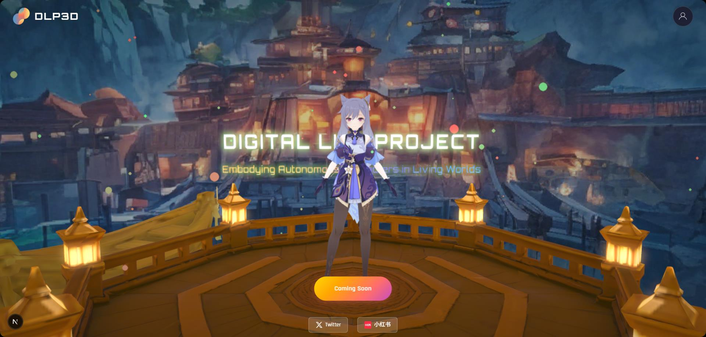
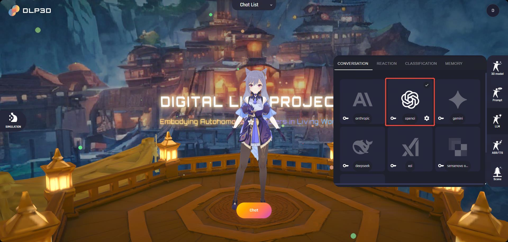

# 🚀 Quick Start

- [Technical Framework](md-technical-architecture)
- [System Requirements](md-system-requirements)
- [Data Preparation](md-data-preparation)
- [Start Service](md-start-service)
- [Handling SSL Certificate Warnings](md-handling-ssl-certificate-warnings)
- [First Chat](md-first-chat)

In this section, we first introduce the DLP3d's technical framework. Then, we present a step-by-step tutorial on how to setup DLP3d services and setup chat.

(md-technical-architecture)=

## Technical Framework

The DLP3d system consists of 3 core components, namely ***Web App***, ***Orchestrator*** and ***Backend & Cloud Services***:

- Web App: provides an intuitive graphical interface for customizing and interacting with 3D avatars. Each character is fully configurable — including 3D models, LLMs, prompts, and voices. Chatting with an embodied AI is as simple as holding the microphone button and speaking. Rather than relying on local assets, the system streams character audio, facial expressions, and body motions in real-time. A robust runtime animation pipeline is implemented to receive, organize, and replay streamed data, featuring mechanisms such as adaptive motion blending, connection-loss recovery, and network health estimation to ensure responsiveness and interactivity.

- Orchestrator: serves as a real-time intelligent conversation engine that coordinates personalized multi-modal AI interaction workflows. It integrates modules for Automatic Speech Recognition (ASR), Large Language Models (LLMs), Text-to-Speech (TTS), emotion analysis, memory management, and 3D animation generation (Audio2Face & Speech2Motion). Designed with modularity and streaming in mind, it supports multiple AI service providers and manages the entire conversation lifecycle. Acting as the conductor, the orchestrator seamlessly synchronizes diverse AI services and algorithmic components into a unified, coherent experience.

- Backend & Cloud Services: encompasses both AI services and the web backend. Users can choose preferred providers for LLM, TTS, and ASR services. The backend is responsible for asset and database management at runtime, delivering unified APIs for user authentication, avatar resource access across the DLP3d ecosystem.

<div style="text-align: center;">
  
  <p><em>Technical Framework</em></p>
</div>


(md-system-requirements)=

## System Requirements

### Backend Services

Make sure that your hardware is of AMD64 architecture and have at least 2GB RAM.

### Web App

Since the web app runs entirely on your browser, it works smoothly across different platforms and devices. We’ve verified successful runs on the following devices:

**Desktop Devices**:

 - Windows/Ubuntu: Intel [i7-8550U](https://www.intel.com/content/www/us/en/products/sku/122589/intel-core-i78550u-processor-8m-cache-up-to-4-00-ghz/specifications.html) with built in UHD Graphics 620 graphics card, 8GB RAM, 1920x1080 screen resolution

 - MacOS: [MacBook Pro (16-inch, 2019)](https://support.apple.com/en-us/111932) or later

:::{tip}
For better gaming experience, we recommend using screen resolution >= 1920x1080.
:::

**Mobile Devices**:

 - iOS: [iPhone 12 Pro Max](https://support.apple.com/en-us/111874) or later

 - iPadOS: [iPad Pro 11-inch (2nd generation)](https://support.apple.com/en-us/118452) or later

(md-data-preparation)=

## Data Preparation

To start DLP3d web service, you need to download the ONNX model file and motion data file and set up the required directory structure.

### Download ONNX Model

1. **Download the ONNX model file:**
   - **GitHub Download:** [unitalker_v0.4.0_base.onnx](https://github.com/LazyBusyYang/CatStream/releases/download/a2f_cicd_files/unitalker_v0.4.0_base.onnx)
   - **Google Drive Download:** [unitalker_v0.4.0_base.onnx](https://drive.google.com/file/d/1E0NTrsh4mciRPb265n64Dd5vR3Sa7Dgx/view?usp=drive_link)
   - **Baidu Cloud：** [unitalker_v0.4.0_base.onnx](https://pan.baidu.com/s/1A_vUj_ZBMFPbO1lgUYVCPA?pwd=shre)

2. **Download the motion data file:**
   - **Google Drive Download:** [motion_data.zip](https://drive.google.com/file/d/112pnjuIuNqADS-fAT6RUIAVPtb3VlWlq/view?usp=drive_link)
   - **Baidu Cloud：** [motion_data.zip](https://pan.baidu.com/s/1YCisRewRQQdYT-GzCZxu-w?pwd=wwqm)

3. **Organize the data:**
   - Create a `weights` directory in your project root if it doesn't exist
   - Create a `data` directory in your project root if it doesn't exist
   - Place the downloaded `unitalker_v0.4.0_base.onnx` file in the `weights` directory
   - Extract the downloaded `motion_data.zip` file to the `data` directory
   - Ensure the following directory structure is created:

```
├─docker-compose.yml
├─data
│   ├─motion_database.db
│   ├─blendshapes_meta
│   ├─joints_meta
│   ├─mesh_glb
│   ├─motion_files
│   ├─restpose_npz
│   └─rigids_meta
└─weights
    └─unitalker_v0.4.0_base.onnx
```
### Directory Structure Explanation

- `docker-compose.yml`: Docker Compose configuration file for running all services.
- `data/`: Directory containing motion-related data files.
  - `motion_database.db`: SQLite database containing motion metadata.
  - `blendshapes_meta/`: Directory for blendshapes metadata files.
  - `joints_meta/`: Directory for joint metadata files.
  - `mesh_glb/`: Directory for 3D mesh files in GLB format.
  - `motion_files/`: Directory containing motion animation files.
  - `restpose_npz/`: Directory for rest pose data in NPZ format.
  - `rigids_meta/`: Directory for rigid body metadata files.
- `weights/`: Directory for storing ONNX model files.
  - `unitalker_v0.4.0_base.onnx`: The main ONNX model file for audio-to-face generation.

(md-start-service)=

## Start Service

The easiest way to get started with DLP3d web service is using the pre-built Docker image. First, make sure that you have Docker and Docker Compose correctly installed.

### Prerequisites

#### For Windows Users
Install [Docker Desktop](https://docs.docker.com/desktop/) which includes both Docker and Docker Compose.

#### For Linux Users
Follow the official documentation to install [Docker Engine](https://docs.docker.com/engine/install/). Docker Compose is included with Docker Engine installation.

After installation, Docker Compose will be available for use.

### Starting the Services

In the provided [docker-compose.yml](https://github.com/dlp3d-ai/dlp3d.ai/blob/main/docker-compose.yml), we demonstrate how to seamlessly orchestrate all DLP3d services — including the backend, frontend, and supporting components. The DLP3D services can be started with a single command:

#### English Version
```bash
# cd to the project root
docker compose up
```

#### Chinese Version
If you need to start the Chinese version, use the following command:
```bash
# cd to the project root
docker compose -f docker-compose-zh.yml up
```

(md-handling-ssl-certificate-warnings)=

## Handling SSL Certificate Warnings

Wait until all the services are started. The application uses self-signed certificates, so you'll need to trust them in your browser for all three services:

### Step 1: Trust the Frontend Service (Port 18000)
Open your browser and visit `https://127.0.0.1:18000`. The browser will show a security warning because we're using a self-signed certificate. Click the `Advanced` button and then `Proceed to 127.0.0.1 (unsafe)`:

<div style="text-align: center;">
  
  <p><em>SSL Certificate Warning</em></p>
</div>

### Step 2: Trust the Backend Service (Port 18001)
Next, visit `https://127.0.0.1:18001` and repeat the same process to trust this certificate.

### Step 3: Trust the Orchestrator Service (Port 18002)
Finally, visit `https://127.0.0.1:18002` and trust this certificate as well.

### Step 4: Start Using the Application
Once all three certificates are trusted, you can return to `https://127.0.0.1:18000` to start using the application. You should see the web interface:

<div style="text-align: center;">
  
  <p><em>Fronted Window Example</em></p>
</div>

(md-first-chat)=

## First Chat

### Setup Account

You need to create an account and login first. Click the `Account` icon on the top-right corner of the window to open the authentication window.

#### Step 1: Register a New User
Select the `REGISTER` tab in the authentication window. Enter your email address and password, then click the register button to create a new account:

<div style="text-align: center;">
  
  <p><em>User Registration</em></p>
</div>

For community edition deployed on your own host, email and password are stored in the local MongoDB database.

#### Step 2: Login to Your Account
After successful registration, switch to the `LOGIN` tab. Enter the email address and password you used during registration, then click `Sign In`:

<div style="text-align: center;">
  
  <p><em>User Authentication</em></p>
</div>

Once you've successfully logged in, the UI panel will display: 

- Left: simulation settings, e.g., whether enable cloth simulation, debug mode.

- Right: chat settings, where the character's prompt, LLMs, TTS are configured.

- Top: chat list settings, you can select your desired avatar or create new avatars here.

- Bottom: entrypoint for starting a chat.

<div style="text-align: center;">
  
  <p><em>Home Page</em></p>
</div>


### Select Avatar

Expand the `Chat List` panel by clicking it. Then, all available avatars will be listed below:

<div style="text-align: center;">
  
  <p><em>Chat List</em></p>
</div>

We provide 4 avatars by default, namely `Keqing-default`, `Furina-default`, `HuTao-default` and `Ani-default`. Notice that the default characters cannot be edited directly. Instead, you should create a new avatar by duplicating existing default avatars. You can find the duplicate button in the top-right corner of each avatar card. The newly created avatar, comparatively, can be further customized. The name at the bottom of the avatar card will be used during the chat, here we rename it as `Keqing-test` as an example:

<div style="text-align: center;">
  
  <p><em>Duplicate Character</em></p>
</div>

### Prompt Settings

To customize an avatar’s intrinsic behaviors—such as personality, abilities, and preferences—open the `Prompt` panel on the right side of the window. Each avatar comes with a default character prompt that you can freely edit to create your own unique personality.

<div style="text-align: center;">
  
  <p><em>Prompt Settings</em></p>
</div>

### Configure LLMs

We employ LLMs to handle conversations, user behavior and relationship with avatar:

- Conversation: handles text conversations, supports multiple LLMs.

- Reaction & Classification: for emotional analysis, which analyzes user intent, character emotional changes, relationship changes and triggered actions.

- Memory: for multi-level conversation memory.

To enable these features, you need to configure api keys for LLMs. Open the `LLM` panel on the right side of window, then, click the `key` icon on the bottom-left side of the LLM card and save your api key on the popped window: 

<div style="text-align: center;">
  
  <p><em>API Key</em></p>
</div>

The LLM logo will be highlighted once the api key is successfully saved. Notice that the backend service will not validate the user uploaded keys. An incorrect api key will break down the chat. 

<div style="text-align: center;">
  
  <p><em>LLM Settings</em></p>
</div>

### Configure TTS

The `ASR/TTS` panel is where you can setup the speech recognition model and change the voice of the avatar:

- ASR(Automatic Speech Recognition): user speech recognition, supports multiple languages and real-time processing

- TTS(Text To Speech): converts text to natural speech, supports multiple voices and emotional expressions

The ASR and TTS also need api keys to get working. Similarly, click the `key` icon to configure api keys.

:::{note}
API keys are stored securely in your local MongoDB database. DLP3D.AI does not collect, transmit, or upload this data.
:::

<div style="text-align: center;">
  
  <p><em>ASR/TTS Settings</em></p>
</div>

### Start Chat

On the `Scene` panel, you can setup the background scene during the chat. Once you have completed the chat settings, click the `Chat` button to chat with the avatar:

<div style="text-align: center;">
  
  <p><em>Start Chat</em></p>
</div>

The browser will jump to a new tab and will connect to the algorithm services to fetch necessary configurations and download runtime resources.

:::{note}
If error occurs during the loading process, an error toast will appear on the screen. Please follow the error message to fix the issue.
:::

Once the loading progress is finished, click the `Start` button to enter the chat. Notice that for the first chat, your browser may request the microphone permission. Please click the `Allow` button so that your speech can be normally processed.

<div style="text-align: center;">
  
  <p><em>Loading Progress</em></p>
</div>

### Talk with Avatar

When entered the chat, the avatar will play opening remark and then enter the idle state. To talk with the avatar, click and hold the `Microphone` button, then start uploading your voice: 

<div style="text-align: center;">
  
  <p><em>Avatar in Idle State</em></p>
</div>

When you have finished your sentence, release the `Microphone` button, the web app will send your voice data to the backend services:

:::{tip}
If the screen is lagging during chat, please consider turning off the cloth simulation from the homepage(`SIMULATION` -> `Cloth Simulation`).
:::

<div style="text-align: center;">
  
  <p><em>Avatar in Listening State</em></p>
</div>

