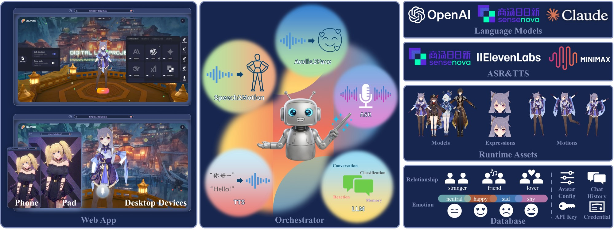
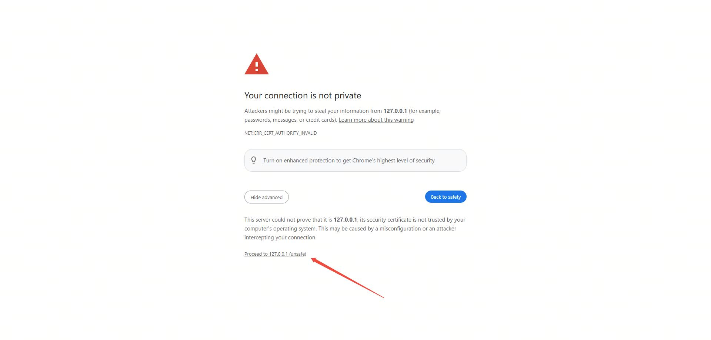
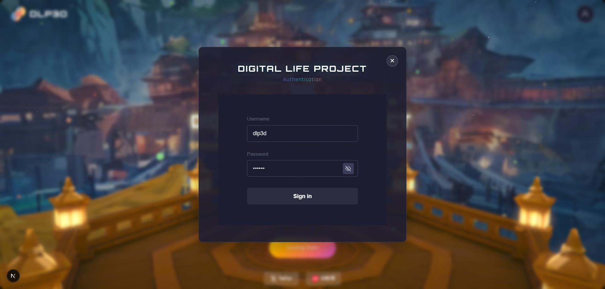
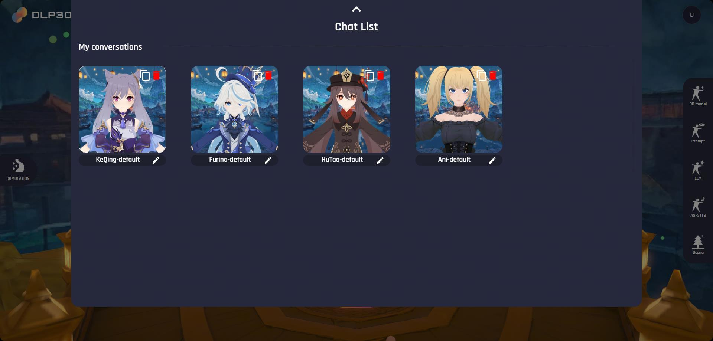
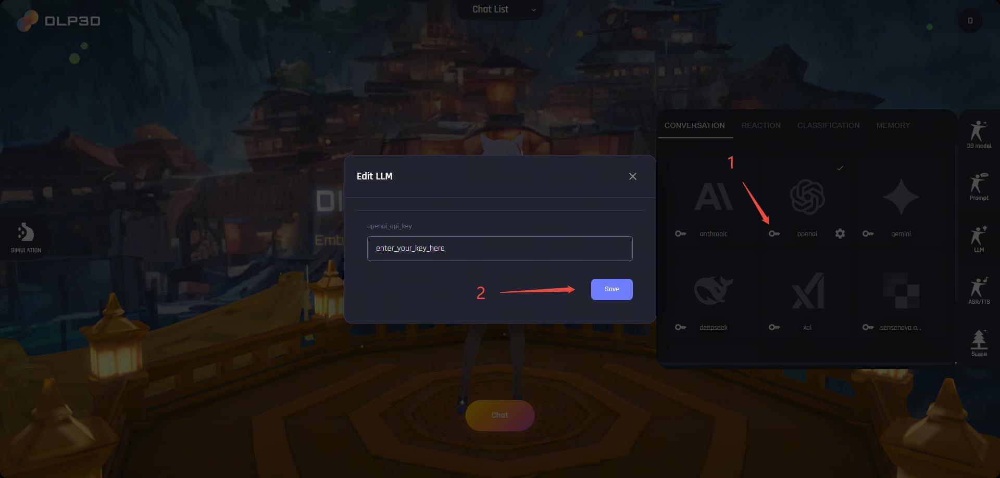
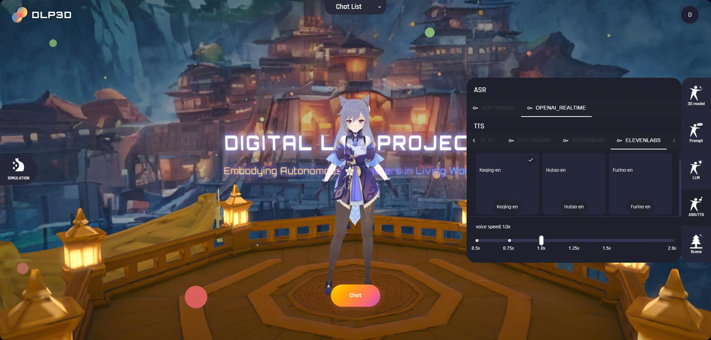
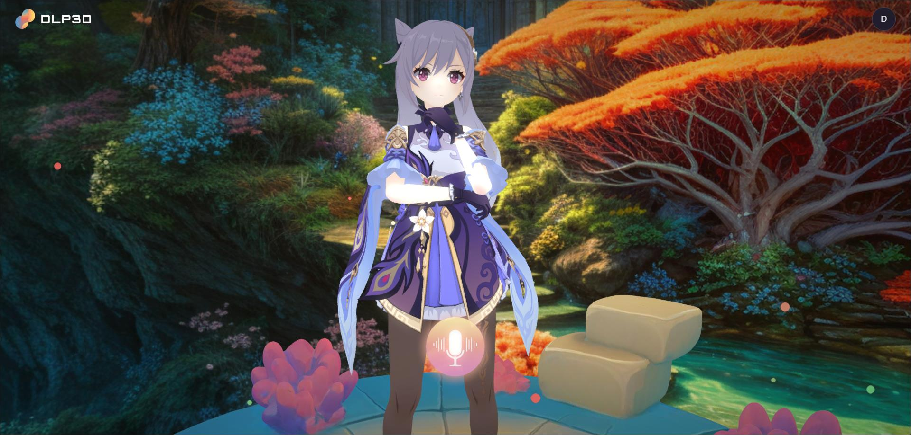

# 🚀 快速开始

- [技术架构](md-technical-architecture)
- [系统要求](md-system-requirements)
- [数据准备](md-data-preparation)
- [启动服务](md-start-service)
- [处理SSL证书警告]((md-handling-ssl-certificate-warnings))
- [首次聊天](md-first-chat)

在本节中，我们首先介绍DLP3d的技术架构。然后，我们提供一个分步教程，说明如何设置DLP3d服务并开始聊天。

(md-technical-architecture)=

## 技术架构

DLP3d系统由3个核心组件组成，即***Web应用***、***Orchestrator***和***后端与云服务***：

- Web应用：提供直观的图形界面，用于自定义和与3D虚拟角色交互。每个角色都是完全可配置的——包括3D模型、LLM、提示词和语音。与具身AI聊天就像按住麦克风按钮说话一样简单。系统不依赖本地资源，而是实时流式传输角色音频、面部表情和身体动作。实现了强大的运行时动画管道来接收、组织和播放流式数据，具有自适应动作混合、连接丢失恢复和网络健康估计等机制，以确保响应性和交互性。

- Orchestrator：作为实时智能对话引擎，协调个性化的多模态AI交互工作流。它集成了自动语音识别(ASR)、大语言模型(LLM)、文本转语音(TTS)、情感分析、记忆管理和3D动画生成(Audio2Face & Speech2Motion)模块。设计时考虑了模块化和流式处理，支持多个AI服务提供商并管理整个对话生命周期。作为指挥者，Orchestrator将各种AI服务和算法组件无缝同步为统一、连贯的体验。

- 后端与云服务：包括AI服务和Web后端。用户可以为LLM、TTS和ASR服务选择首选提供商。后端负责运行时的资产和数据库管理，为DLP3d生态系统中的用户认证、虚拟角色资源访问提供统一的API。

<div style="text-align: center;">
  
  <p><em>技术架构</em></p>
</div>


(md-system-requirements)=

## 系统要求

### 后端服务

确保您的硬件是AMD64架构，并且至少有2GB RAM。

### Web应用

由于Web应用完全在您的浏览器中运行，它可以在不同的平台和设备上流畅运行。我们已在以下设备上验证了成功运行：

**桌面设备**：

 - Windows/Ubuntu：Intel [i7-8550U](https://www.intel.com/content/www/us/en/products/sku/122589/intel-core-i78550u-processor-8m-cache-up-to-4-00-ghz/specifications.html)，内置UHD Graphics 620显卡，8GB RAM，1920x1080屏幕分辨率

 - MacOS：[MacBook Pro (16英寸, 2019)](https://support.apple.com/en-us/111932) 或更新版本

:::{tip}
为了获得更好的游戏体验，我们建议使用屏幕分辨率 >= 1920x1080。
:::

**移动设备**：

 - Android：

 - iOS：[iPhone 12 Pro Max](https://support.apple.com/en-us/111874) 或更新版本

 - iPadOS：

(md-data-preparation)=

## 数据准备

要启动DLP3d Web服务，您需要下载ONNX模型文件和动作数据文件，并设置所需的目录结构。

### 下载ONNX模型

1. **下载ONNX模型文件：**
   - **GitHub下载：** [unitalker_v0.4.0_base.onnx](https://github.com/LazyBusyYang/CatStream/releases/download/a2f_cicd_files/unitalker_v0.4.0_base.onnx)
   - **Google Drive下载：** [unitalker_v0.4.0_base.onnx](https://drive.google.com/file/d/1E0NTrsh4mciRPb265n64Dd5vR3Sa7Dgx/view?usp=drive_link)
   - **百度网盘：** [unitalker_v0.4.0_base.onnx](https://pan.baidu.com/s/1A_vUj_ZBMFPbO1lgUYVCPA?pwd=shre)

2. **下载动作数据文件：**
   - **Google Drive下载：** [motion_data.zip](https://drive.google.com/file/d/112pnjuIuNqADS-fAT6RUIAVPtb3VlWlq/view?usp=drive_link)
   - **百度网盘：** [motion_data.zip](https://pan.baidu.com/s/1YCisRewRQQdYT-GzCZxu-w?pwd=wwqm)

3. **整理数据：**
   - 如果不存在，在项目根目录创建`weights`目录
   - 如果不存在，在项目根目录创建`data`目录
   - 将下载的`unitalker_v0.4.0_base.onnx`文件放置在`weights`目录中
   - 将下载的`motion_data.zip`文件解压到`data`目录中
   - 确保创建以下目录结构：

```
├─docker-compose.yml
├─data
│   ├─motion_database.db
│   ├─blendshapes_meta
│   ├─joints_meta
│   ├─mesh_glb
│   ├─motion_files
│   ├─restpose_npz
│   └─rigids_meta
└─weights
    └─unitalker_v0.4.0_base.onnx
```

### 目录结构说明

- `docker-compose.yml`：用于运行所有服务的Docker Compose配置文件。
- `data/`：包含动作相关数据文件的目录。
  - `motion_database.db`：包含动作数据标注的SQLite数据库。
  - `blendshapes_meta/`：blendshapes元数据文件的目录。
  - `joints_meta/`：关节元数据文件的目录。
  - `mesh_glb/`：GLB格式3D模型文件的目录。
  - `motion_files/`：包含动作动画文件的目录。
  - `restpose_npz/`：NPZ格式RestPose数据的目录。
  - `rigids_meta/`：刚体元数据文件的目录。
- `weights/`：存储ONNX模型文件的目录。
  - `unitalker_v0.4.0_base.onnx`：用于面部动画生成的主要ONNX模型文件。

(md-start-service)=

## 启动服务

启动DLP3d Web服务最简单的方法是使用预构建的Docker镜像。首先，确保您已正确安装Docker和Docker Compose。

### 前置条件

#### Windows用户
安装[Docker Desktop](https://docker.cadn.net.cn/manuals/desktop)，Docker Compose也包含在其中。

#### Linux用户
按照官方文档安装[Docker Engine](https://docs.docker.com/engine/install/)。Docker Compose也包含在其中。

安装完成后，Docker Compose即可使用。

### 启动服务

在提供的[docker-compose.yml](https://github.com/dlp3d-ai/dlp3d.ai/blob/main/docker-compose.yml)中，我们演示了如何无缝编排所有DLP3d服务——包括后端、前端和支持组件。DLP3D服务可以通过单个命令启动：

#### 英文版本
```bash
# cd到项目根目录
docker compose up
```

#### 中文版本
如果您需要启动中文版本，请使用以下命令：
```bash
# cd到项目根目录
docker compose -f docker-compose-zh.yml up
```
(md-handling-ssl-certificate-warnings)=

## 处理SSL证书警告

等待所有服务启动。应用程序使用自签名证书，因此您需要在浏览器中信任所有三个服务的证书：

### 步骤1：信任前端服务（端口18000）
打开浏览器并访问`https://127.0.0.1:18000`。由于我们使用自签名证书，浏览器将显示安全警告。点击`高级`按钮，然后点击`继续访问127.0.0.1（不安全）`：

<div style="text-align: center;">
  
  <p><em>SSL证书警告</em></p>
</div>

### 步骤2：信任后端服务（端口18001）
接下来，访问`https://127.0.0.1:18001`并重复相同的过程来信任此证书。

### 步骤3：信任Orchestrator服务（端口18002）
最后，访问`https://127.0.0.1:18002`并信任此证书。

### 步骤4：开始使用应用程序
一旦所有三个证书都被信任，您可以返回到`https://127.0.0.1:18000`开始使用应用程序。您应该看到Web界面：

<div style="text-align: center;">
  
  <p><em>前端窗口示例</em></p>
</div>

(md-first-chat)=

## 首次聊天

### 设置账户

您需要先创建账户并登录。点击窗口右上角的`账户`图标打开认证窗口。

#### 步骤1：注册新用户
在认证窗口中选择`REGISTER`选项卡。输入您的电子邮件地址和密码，然后点击注册按钮创建新账户：

<div style="text-align: center;">
  
  <p><em>用户注册</em></p>
</div>

对于部署在自己主机上的社区版，电子邮件和密码存储在本地MongoDB数据库中。

#### 步骤2：登录您的账户
注册成功后，切换到`LOGIN`选项卡。输入您在注册时使用的电子邮件地址和密码，然后点击`Sign In`：

<div style="text-align: center;">
  
  <p><em>用户认证</em></p>
</div>

成功登录后，UI面板将显示：

- 左侧：模拟设置，例如是否启用布料模拟、调试模式。

- 右侧：聊天设置，配置角色的提示词、LLM、TTS。

- 顶部：聊天列表设置，您可以在此选择所需的虚拟角色或创建新的虚拟角色。

- 底部：开始聊天的入口点。

<div style="text-align: center;">
  
  <p><em>主页</em></p>
</div>


### 选择虚拟角色

通过点击展开`聊天列表`面板。然后，所有可用的虚拟角色将列在下方：

<div style="text-align: center;">
  
  <p><em>聊天列表</em></p>
</div>

我们默认提供4个虚拟角色，即`刻晴-系统默认`、`芙宁娜-系统默认`、`胡桃-系统默认`和`Ani-系统默认`。请注意，默认角色不能直接编辑。您可以通过复制现有的默认虚拟角色来创建新的虚拟角色，并编辑通过复制产生的角色，每个虚拟角色卡片的右上角提供了复制按钮。虚拟角色卡片底部的名称将在聊天期间使用，这里我们将其重命名为`Keqing-test`作为示例：

<div style="text-align: center;">
  
  <p><em>复制角色</em></p>
</div>

### 提示词设置

要自定义虚拟角色的内在行为——如个性、能力和偏好——打开窗口右侧的`提示词`面板。每个虚拟角色都带有一个默认的角色提示词，您可以自由编辑以创建自己独特的个性。

<div style="text-align: center;">
  
  <p><em>提示词设置</em></p>
</div>

### 配置LLM

我们使用LLM来处理对话、用户行为和与虚拟角色的关系：

- 对话：处理文本对话，支持多个LLM。

- 反应与分类：用于情感分析，分析用户意图、角色情感变化、关系变化和触发的动作。

- 记忆：用于处理多级对话记忆。

要启用这些功能，您需要为LLM配置API密钥。打开窗口右侧的`LLM`面板，然后点击LLM卡片左下角的`key`图标，在弹出窗口中保存您的API密钥：

<div style="text-align: center;">
  
  <p><em>API密钥</em></p>
</div>

API密钥成功保存后，LLM徽标将高亮显示。请注意，后端服务不会验证用户上传的密钥。错误的API密钥将导致聊天无法推进。

<div style="text-align: center;">
  
  <p><em>LLM设置</em></p>
</div>

### 配置TTS

`ASR/TTS`面板是您可以设置语音识别模型并更改虚拟角色语音的地方：

- ASR（自动语音识别）：用户语音识别，支持多种语言和实时处理

- TTS（文本转语音）：将文本转换为自然语音，支持多种语音和情感表达

ASR和TTS也需要API密钥才能工作。同样，点击`key`图标来配置API密钥。

:::{note}
API密钥安全地存储在您的本地MongoDB数据库中。DLP3D.AI不会收集、传输或上传此数据。
:::

<div style="text-align: center;">
  
  <p><em>ASR/TTS设置</em></p>
</div>

### 开始聊天

在`场景`面板上，您可以设置聊天期间的背景场景。完成聊天设置后，点击`聊天`按钮与虚拟角色聊天：

<div style="text-align: center;">
  
  <p><em>开始聊天</em></p>
</div>

浏览器将跳转到新标签页并连接到算法服务以获取必要的配置并下载运行时资源。

:::{note}
如果在加载过程中发生错误，屏幕上将出现错误提示。请按照错误消息修复问题。
:::

加载进度完成后，点击`开始`按钮进入聊天。请注意，对于首次聊天，您的浏览器可能会请求麦克风权限。请点击`允许`按钮，以便您的语音可以正常处理。

<div style="text-align: center;">
  
  <p><em>加载进度</em></p>
</div>

### 与虚拟角色对话

进入聊天后，虚拟角色将播放开场白，然后进入空闲状态。要与虚拟角色对话，点击并按住`麦克风`按钮，然后开始上传您的语音：

<div style="text-align: center;">
  
  <p><em>虚拟角色空闲状态</em></p>
</div>

当您完成句子后，释放`麦克风`按钮，Web应用将把您的语音数据发送到后端服务：

:::{tip}
如果聊天时屏幕卡顿，请考虑从主页关闭布料模拟（`SIMULATION` -> `Cloth Simulation`）。
:::

<div style="text-align: center;">
  
  <p><em>虚拟角色聆听状态</em></p>
</div>
